# Blue Fire Platform - Architecture Diagrams

## 🏗️ Detailed System Architecture

### High-Level System Overview
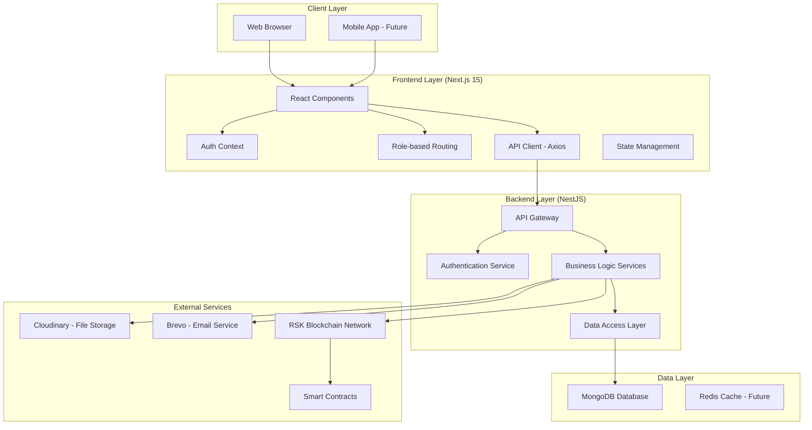

## 🔐 Authentication & Authorization Flow

### Complete Auth Flow
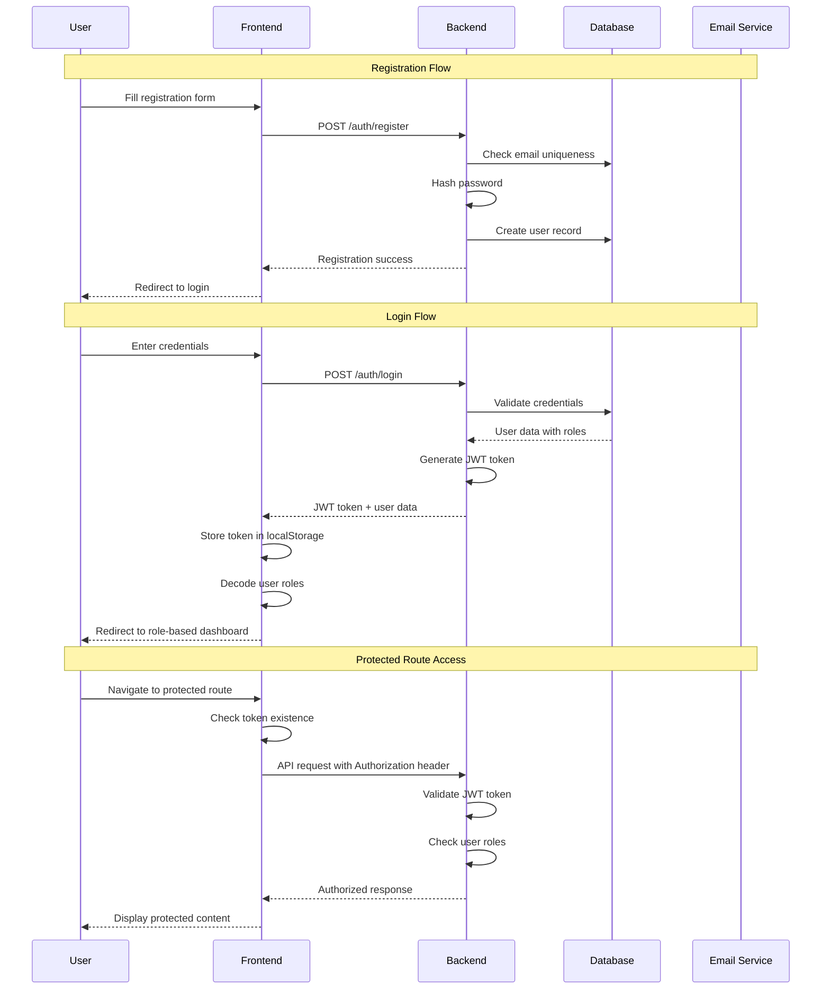

### Role-Based Access Control
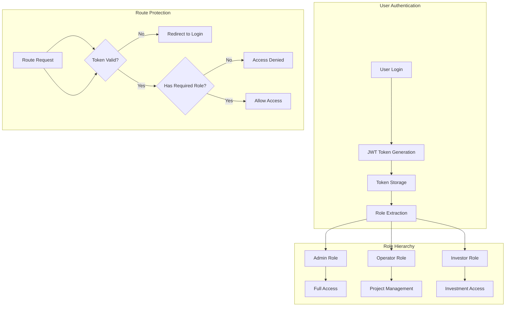

## 🛣️ API Route Structure

### Complete API Endpoint Map
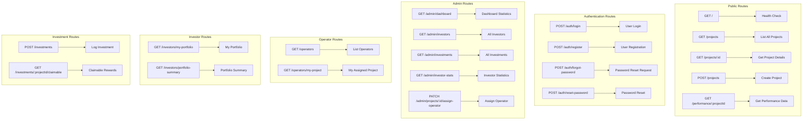

## 🎨 Frontend Component Architecture

### Component Hierarchy
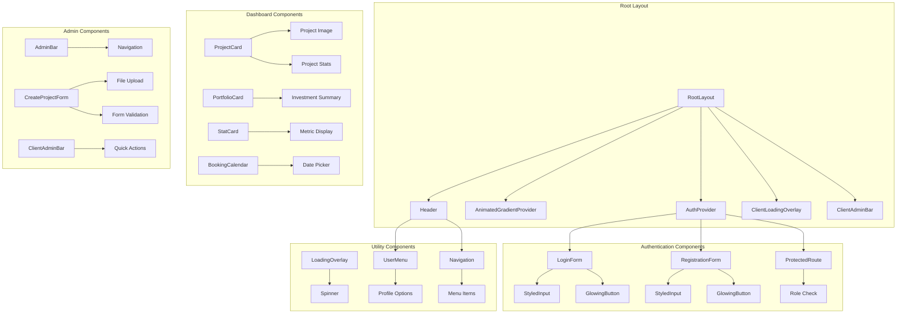

## 🔄 Data Flow Patterns

### Investment Process Flow
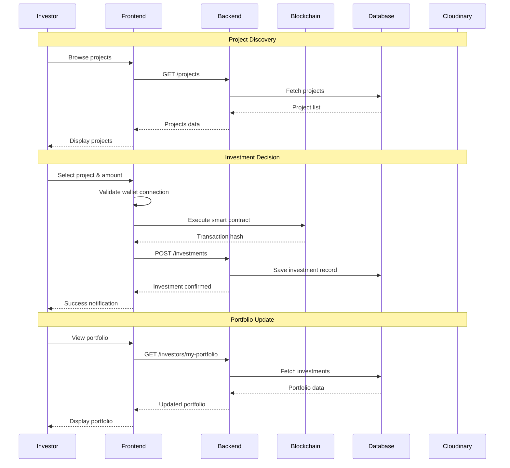

### Project Management Flow
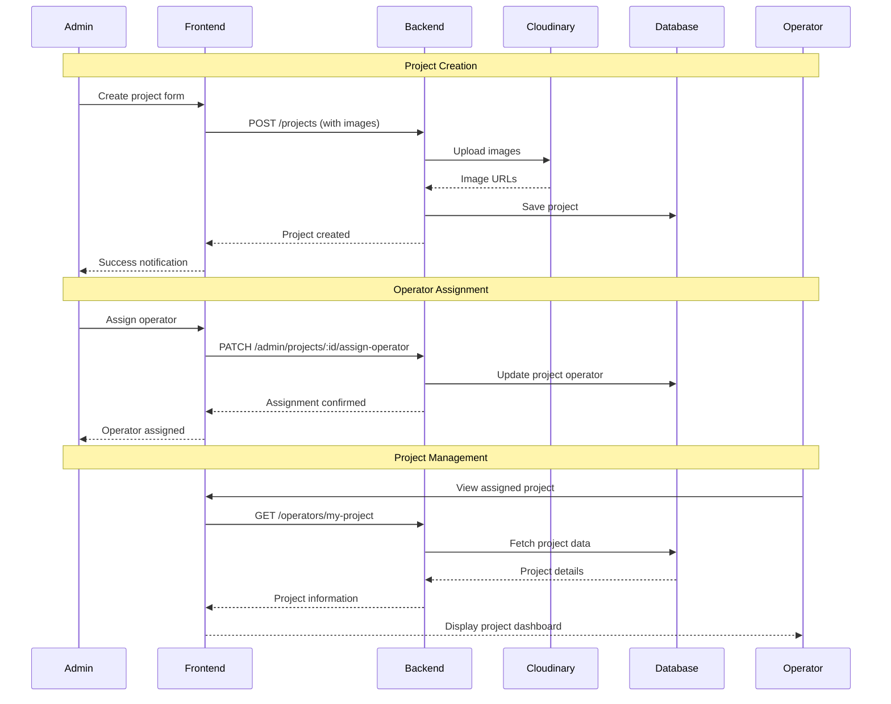

## 🗄️ Database Relationships

### Entity Relationship Diagram
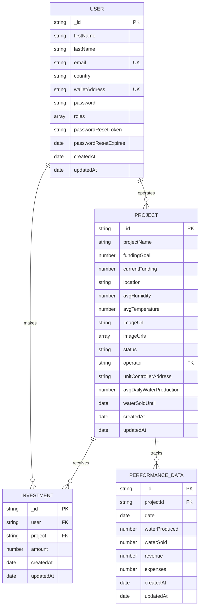

## 🔧 Module Dependencies

### Backend Module Structure
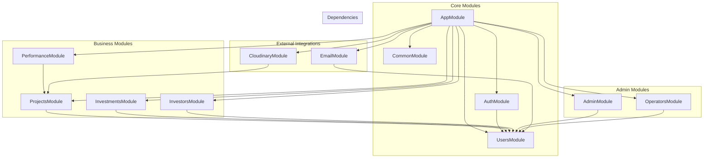

## 🚀 Deployment Architecture

### Production Deployment Flow
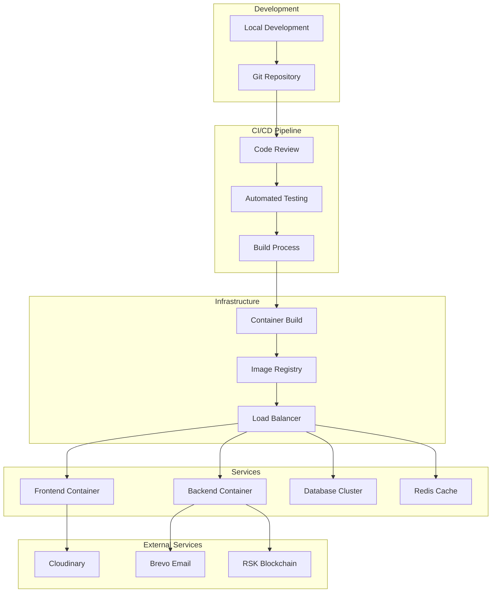

## 📊 Performance Monitoring

### System Monitoring Architecture
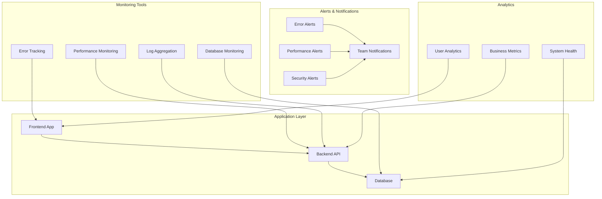

---

These diagrams provide a comprehensive view of the Blue Fire Platform's architecture, showing the relationships between components, data flows, and system interactions. Each diagram focuses on a specific aspect of the system to help understand the overall design and implementation. 