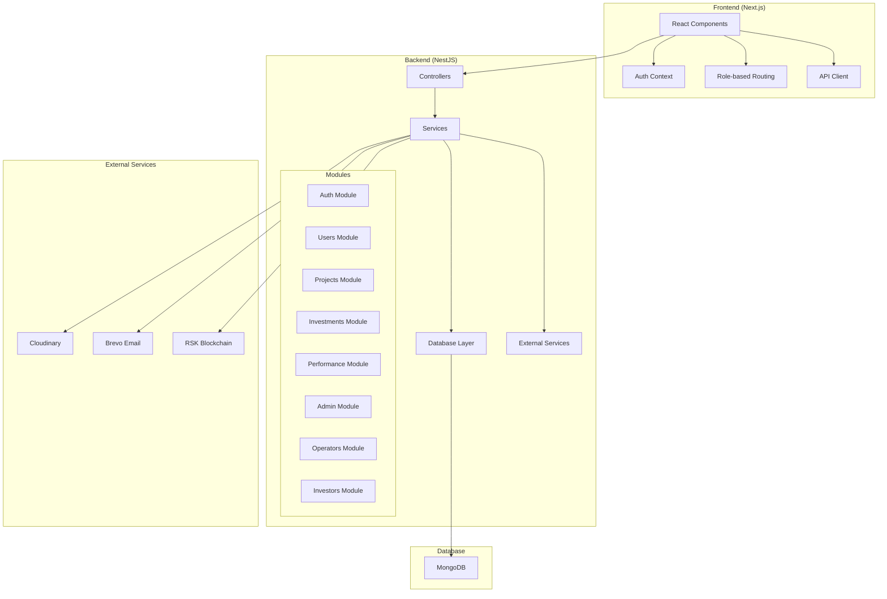
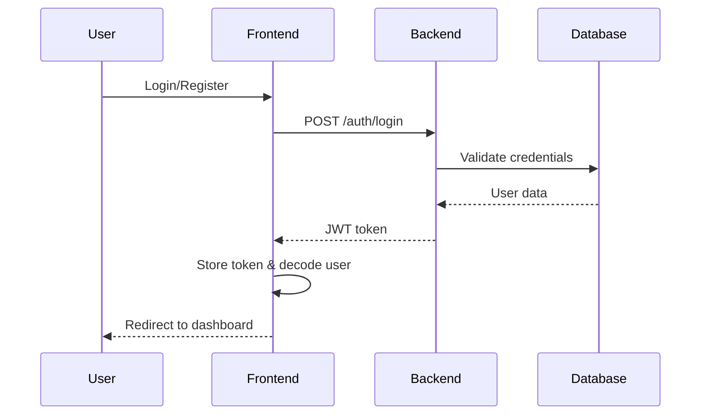
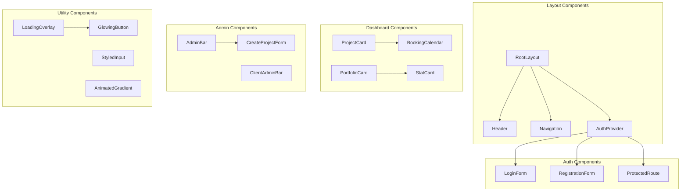
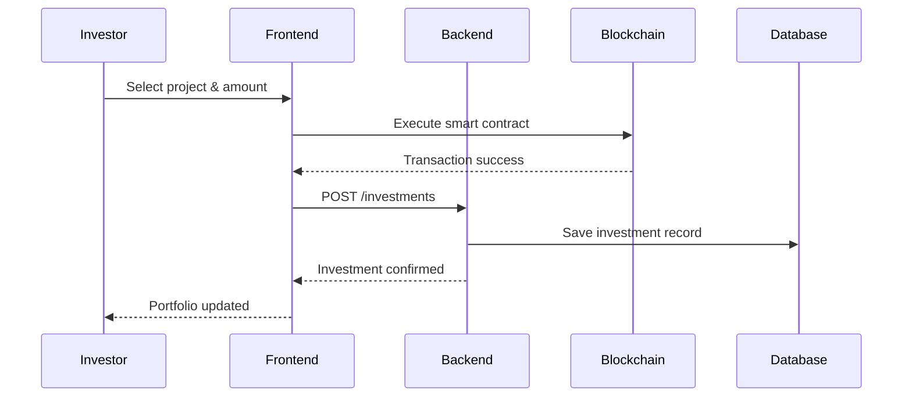
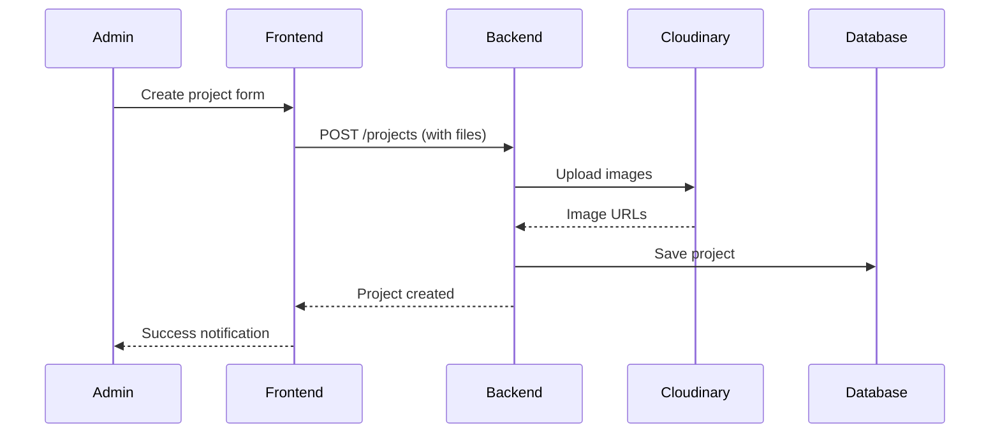

# Blue Fire Platform - Project Overview

## 🚀 Project Summary

**Blue Fire Platform** is a blockchain-based water production investment platform built with a modern tech stack. The platform enables investors to fund water production projects while providing operators with tools to manage their projects and track performance.

### Key Features
- **Multi-role Authentication System** (Admin, Operator, Investor)
- **Blockchain Integration** (RSK Testnet with smart contracts)
- **Real-time Performance Tracking**
- **Investment Management**
- **Project Management**
- **Email Notifications**
- **File Upload & Cloud Storage**

---

## 🏗️ Architecture Overview

### Tech Stack
- **Backend**: NestJS (Node.js) with TypeScript
- **Frontend**: Next.js 15 with React 19 and TypeScript
- **Database**: MongoDB with Mongoose ODM
- **Blockchain**: RSK Testnet with Ethers.js
- **Authentication**: JWT with Passport.js
- **File Storage**: Cloudinary
- **Email Service**: Brevo (formerly Sendinblue)
- **Styling**: Tailwind CSS 4
- **State Management**: React Context API

---

## 📊 System Architecture Diagram



---

## 🔐 Authentication & Authorization System

### User Roles
1. **Admin**: Full platform access, user management, project oversight
2. **Operator**: Project management, performance tracking
3. **Investor**: Investment management, portfolio tracking

### Authentication Flow


---

## 🛣️ Backend API Routes

### Authentication Routes (`/auth`)
- `POST /auth/login` - User login
- `POST /auth/register` - User registration
- `POST /auth/forgot-password` - Password reset request
- `POST /auth/reset-password` - Password reset

### Public Routes
- `GET /` - Health check
- `GET /projects` - Get all projects
- `GET /projects/:id` - Get project by ID
- `POST /projects` - Create new project (with file upload)
- `GET /performance/:projectId` - Get project performance

### Protected Routes by Role

#### Admin Routes (`/admin`)
- `GET /admin/dashboard` - Admin dashboard stats
- `GET /admin/investors` - Get all active investors
- `GET /admin/investments` - Get all investments
- `GET /admin/investors/:investorId/investments` - Get investor investments
- `GET /admin/investor-stats` - Get investor statistics
- `PATCH /admin/projects/:projectId/assign-operator` - Assign operator to project

#### Operator Routes (`/operators`)
- `GET /operators` - Get all operators (Admin only)
- `GET /operators/my-project` - Get assigned project

#### Investor Routes (`/investors`)
- `GET /investors/my-portfolio` - Get investor portfolio
- `GET /investors/portfolio-summary` - Get portfolio summary

#### Investment Routes (`/investments`)
- `POST /investments` - Log new investment
- `GET /investments/:projectId/claimable` - Get claimable rewards

---

## 🎨 Frontend Views & Components

### Page Structure
```
src/app/
├── page.tsx                    # Landing page
├── login/page.tsx             # Login form
├── register/page.tsx          # Registration form
├── forgot-password/page.tsx   # Password reset request
├── reset-password/page.tsx    # Password reset
├── dashboard/                 # Main dashboard
│   ├── layout.tsx
│   ├── page.tsx
│   └── projects/[id]/page.tsx # Project details
├── portfolio/                 # Investor portfolio
│   ├── layout.tsx
│   └── page.tsx
├── admin/                     # Admin dashboard
│   ├── dashboard/
│   │   ├── layout.tsx
│   │   └── page.tsx
│   ├── investors/
│   │   ├── layout.tsx
│   │   └── page.tsx
│   └── projects/
│       ├── [id]/page.tsx
│       └── new/page.tsx
└── operator/                  # Operator dashboard
    └── dashboard/
        ├── layout.tsx
        └── page.tsx
```

### Component Architecture


---

## 🗄️ Database Schema

### User Schema
```typescript
{
  firstName: string (required)
  lastName: string (required)
  email: string (required, unique)
  country: string (required)
  walletAddress: string (required, unique)
  password: string (required, hidden)
  roles: string[] (required) // ['Admin', 'Operator', 'Investor']
  passwordResetToken?: string
  passwordResetExpires?: Date
  timestamps: true
}
```

### Project Schema
```typescript
{
  projectName: string (required)
  fundingGoal: number (required)
  currentFunding: number (default: 0)
  location: string
  avgHumidity: number
  avgTemperature: number
  imageUrl: string (default: placeholder)
  imageUrls: string[] (default: [])
  status: string (enum: ['SEEKING_FUNDING', 'OPERATIONAL', 'COMPLETED'])
  operator?: User (ref)
  unitControllerAddress?: string
  avgDailyWaterProduction: number
  waterSoldUntil?: Date
  timestamps: true
}
```

### Investment Schema
```typescript
{
  user: string (ref: User, required)
  project: string (ref: Project, required)
  amount: number (required)
  timestamps: true
}
```

### Performance Data Schema
```typescript
{
  projectId: string (required)
  date: Date (required)
  waterProduced: number
  waterSold: number
  revenue: number
  expenses: number
  timestamps: true
}
```

---

## 🔗 Data Flow Diagrams

### Investment Flow


### Project Creation Flow


---

## 🔧 Key Features & Integrations

### Blockchain Integration
- **Network**: RSK Testnet (Chain ID: 31)
- **Smart Contracts**: 
  - StakingVault.sol - Investment management
  - UnitController.sol - Project control
- **Library**: Ethers.js v6

### File Management
- **Service**: Cloudinary
- **Features**: Image upload, transformation, CDN
- **Integration**: Multer middleware for file handling

### Email System
- **Service**: Brevo (Sendinblue)
- **Features**: Password reset, notifications
- **Templates**: HTML email templates

### Security Features
- **JWT Authentication** with 24h expiration
- **Role-based Access Control** (RBAC)
- **Password Hashing** with bcrypt
- **Rate Limiting** on API endpoints
- **CORS Configuration** for frontend
- **Input Validation** with class-validator

---

## 🚀 Development & Deployment

### Environment Variables
```bash
# Backend
DATABASE_URL=mongodb://localhost:27017/blue-fire
JWT_SECRET=your-secret-key
FRONTEND_URL=http://localhost:3000
PORT=3001

# External Services
CLOUDINARY_CLOUD_NAME=your-cloud-name
CLOUDINARY_API_KEY=your-api-key
CLOUDINARY_API_SECRET=your-api-secret

BREVO_API_KEY=your-brevo-key

# Blockchain
STAKING_VAULT_ADDRESS=contract-address
UNIT_CONTROLLER_ADDRESS=contract-address
```

### Development Commands
```bash
# Backend
npm run start:dev    # Development server
npm run build        # Build for production
npm run test         # Run tests
npm run seed         # Seed database

# Frontend
npm run dev          # Development server
npm run build        # Build for production
npm run lint         # Lint code
```

---

## 📈 Performance & Monitoring

### Backend Monitoring
- **Global Exception Filter** for error handling
- **Logging Interceptor** for request/response logging
- **Transform Interceptor** for response formatting
- **Rate Limiting** for API protection

### Frontend Performance
- **Next.js 15** with App Router
- **Turbopack** for fast development
- **Client-side caching** with localStorage
- **Optimized images** with Cloudinary

---

## 🔮 Future Enhancements

### Planned Features
- **Real-time Notifications** with WebSockets
- **Advanced Analytics Dashboard**
- **Mobile Application**
- **Multi-language Support**
- **Advanced Blockchain Features**
- **API Documentation** with Swagger
- **Automated Testing** with E2E tests

### Scalability Considerations
- **Database Indexing** for performance
- **Caching Layer** with Redis
- **Load Balancing** for high traffic
- **Microservices Architecture** for modularity
- **Containerization** with Docker

---

This overview provides a comprehensive understanding of the Blue Fire Platform's architecture, features, and implementation details. The platform is designed to be scalable, secure, and user-friendly while leveraging modern web technologies and blockchain integration. 