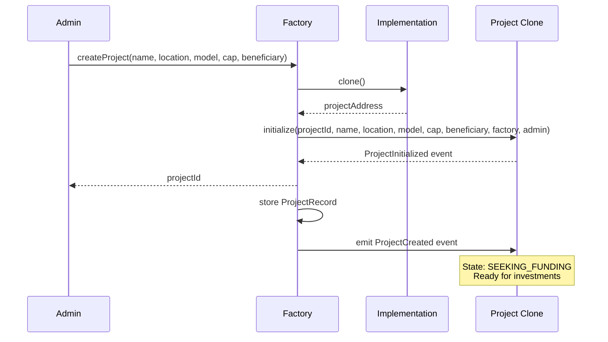
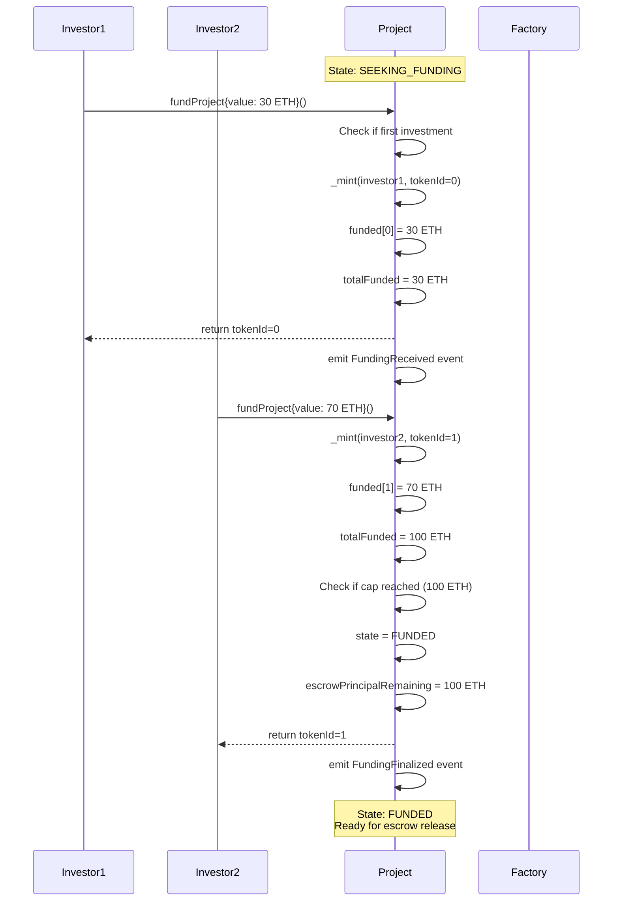
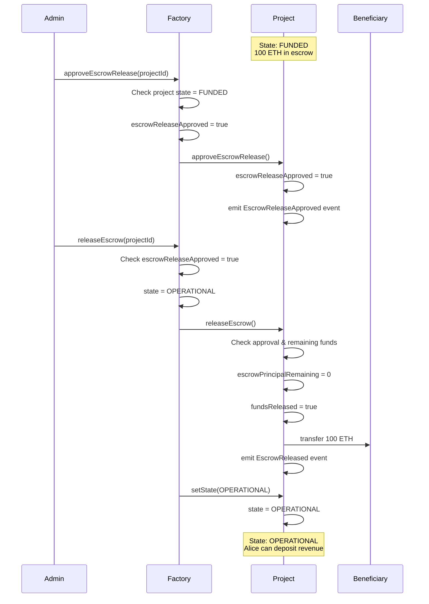
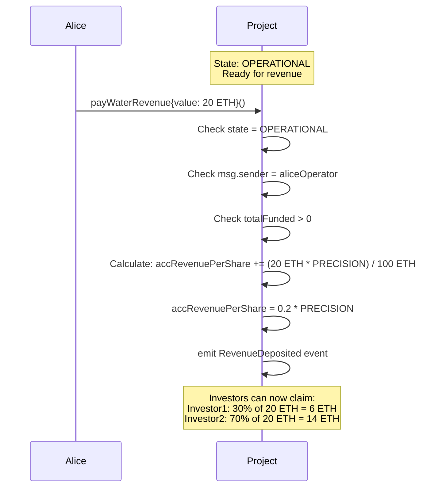
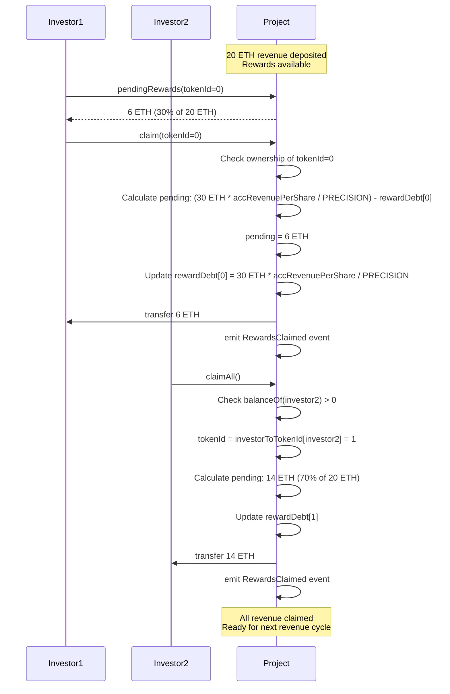
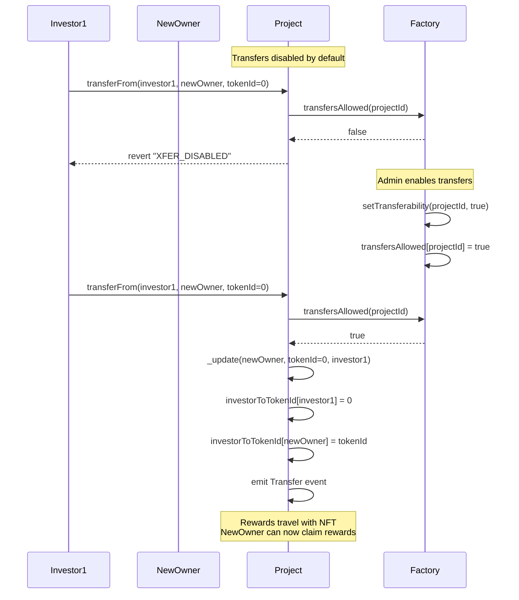
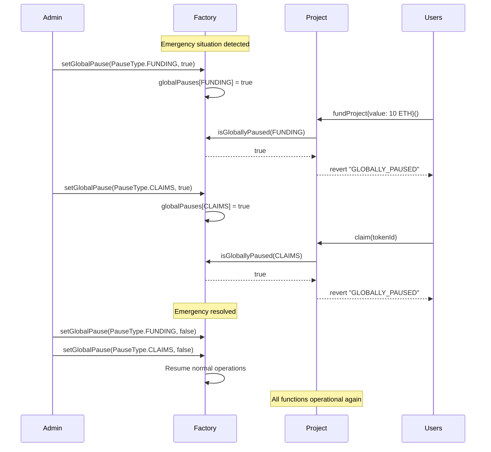

# Blue Fire Platform - User Stories & Test Coverage

## Table of Contents
1. [Admin: Project Creation](#1-admin-project-creation)
2. [Investors: Project Funding](#2-investors-project-funding) 
3. [Admin: Escrow Release](#3-admin-escrow-release)
4. [Alice: Revenue Deposit](#4-alice-revenue-deposit)
5. [Investors: Reward Claims](#5-investors-reward-claims)
6. [Investors: NFT Transfers](#6-investors-nft-transfers)
7. [Admin: Platform Management](#7-admin-platform-management)

---

## 1. Admin: Project Creation

### User Story
> As an admin, I want to create new water machine projects so investors can fund them.

### Associated Tests
**FactoryTest.sol:**
- ✅ `testCreateProject()` - Basic project creation
- ✅ `testCreateProjectFailsNotAdmin()` - Access control
- ✅ `testCreateProjectFailsWithZeroCap()` - Validation
- ✅ `testCreateProjectFailsWithEmptyName()` - Validation  
- ✅ `testCreateProjectWithZeroBeneficiary()` - Default beneficiary handling

---

## 2. Investors: Project Funding

### User Story
> As an investor, I want to fund projects with ETH and receive NFT positions.

### Associated Tests
**FundingTest.sol:**
- ✅ `testFirstFunding()` - Initial investment and NFT minting
- ✅ `testMultipleFundingsFromSameInvestor()` - Cumulative investments
- ✅ `testMultipleInvestors()` - Multiple different investors
- ✅ `testFundingCapReached()` - Automatic state transition
- ✅ `testMultipleInvestorsExactCap()` - Exact cap funding
- ✅ `testOverfundPrevented()` - Cap enforcement
- ✅ `testFundingAfterCapReached()` - Post-cap rejection
- ✅ `testZeroFundingReverts()` - Zero amount validation
- ✅ `testFundingInWrongState()` - State validation
- ✅ `testFundingWithGlobalPause()` - Pause functionality

---

## 3. Admin: Escrow Release

### User Story
> As an admin, I want to release funding to machine operators via two-step escrow.

### Associated Tests
**EscrowTest.sol:**
- ✅ `testApproveEscrowRelease()` - Step 1 approval
- ✅ `testReleaseEscrow()` - Step 2 release
- ✅ `testCompleteEscrowFlow()` - Full two-step process
- ✅ `testApproveEscrowReleaseFailsNotAdmin()` - Access control
- ✅ `testApproveEscrowReleaseFailsNotFunded()` - State validation
- ✅ `testReleaseEscrowFailsNotApproved()` - Sequential requirement
- ✅ `testReleaseEscrowFailsAlreadyReleased()` - Duplicate prevention
- ✅ `testEscrowReleaseWithDifferentBeneficiary()` - Beneficiary flexibility

---

## 4. Alice: Revenue Deposit

### User Story
> As an operator, I want to deposit water sales revenue so investors get paid.

### Associated Tests
**RevenueTest.sol:**
- ✅ `testFirstRevenueDeposit()` - Initial revenue deposit
- ✅ `testMultipleRevenueDeposits()` - Cumulative revenue tracking
- ✅ `testPendingRewardsCalculation()` - Pro-rata distribution calculation
- ✅ `testRevenueDistributionWithDifferentShares()` - Various investment ratios
- ✅ `testLargeRevenueDeposit()` - High-value deposits
- ✅ `testAccumulatorPrecision()` - Precision edge cases
- ✅ `testRevenueDepositFailsNotAlice()` - Access control
- ✅ `testRevenueDepositFailsWrongState()` - State validation
- ✅ `testRevenueDepositFailsZeroAmount()` - Amount validation
- ✅ `testRevenueWithNoFunding()` - Edge case handling

---

## 5. Investors: Reward Claims

### User Story
> As an investor, I want to claim my accumulated rewards when ready.

### Associated Tests
**ClaimTest.sol:**
- ✅ `testClaimRewards()` - Basic reward claiming
- ✅ `testClaimAllRewards()` - Claim all functionality
- ✅ `testMultipleInvestorClaims()` - Simultaneous claims
- ✅ `testClaimAfterAdditionalRevenue()` - Sequential revenue deposits
- ✅ `testPartialClaimPattern()` - Multiple claim cycles
- ✅ `testClaimingIncrementalRevenue()` - Asynchronous claiming
- ✅ `testComplexAsynchronousClaimScenario()` - Complex timing scenarios
- ✅ `testMultipleRevenueMultipleClaimsAccuracy()` - Accuracy across cycles
- ✅ `testRewardDebtAccuracy()` - Reward debt calculation
- ✅ `testClaimFailsNotOwner()` - Ownership validation
- ✅ `testClaimFailsNoRewards()` - Zero rewards validation

---

## 6. Investors: NFT Transfers

### User Story
> As an investor, I want to transfer/trade my position NFTs (if enabled).

### Associated Tests
**TransferGateTest.sol:**
- ✅ `testTransferDisabledByDefault()` - Default transfer blocking
- ✅ `testEnableTransfers()` - Admin enabling transfers
- ✅ `testTransferWorksAfterEnabled()` - Successful transfers
- ✅ `testTransferBetweenExistingInvestors()` - Investor-to-investor transfers
- ✅ `testRewardsFollowToken()` - Reward ownership follows NFT
- ✅ `testTransferUpdatesInvestorMapping()` - Mapping updates
- ✅ `testTransferByApprovedParty()` - Approved transfers
- ✅ `testTransferByOperator()` - Operator transfers
- ✅ `testMintingAlwaysWorks()` - Minting bypass transfer gate
- ✅ `testBurningAlwaysWorks()` - Burning bypass transfer gate

---

## 7. Admin: Platform Management

### User Story
> As an admin, I want emergency pause controls for platform security.

### Associated Tests
**FactoryTest.sol:**
- ✅ `testGlobalPause()` - Emergency pause functionality
- ✅ `testSetProjectState()` - Manual state management
- ✅ `testSetTransferability()` - Transfer control
- ✅ `testSetAlice()` - Operator assignment

**Distributed across test files:**
- ✅ `testFundingWithGlobalPause()` - Funding pause enforcement
- ✅ `testRevenueDepositWithGlobalPause()` - Revenue pause enforcement  
- ✅ `testClaimWithGlobalPause()` - Claims pause enforcement

---

## Test Coverage Summary

| User Story | Test Files | Total Tests | Status |
|------------|------------|-------------|--------|
| Project Creation | FactoryTest.sol | 5 tests | ✅ 100% |
| Project Funding | FundingTest.sol | 12 tests | ✅ 100% |
| Escrow Release | EscrowTest.sol | 17 tests | ✅ 100% |
| Revenue Deposit | RevenueTest.sol | 14 tests | ✅ 100% |
| Reward Claims | ClaimTest.sol | 19 tests | ✅ 100% |
| NFT Transfers | TransferGateTest.sol | 19 tests | ✅ 100% |
| Platform Management | FactoryTest.sol | 13 tests | ✅ 100% |

**Total: 97 tests covering all user stories** ✅

---

## Integration Flow Test

The complete end-to-end flow is tested in:
- 📜 **`script/TestInteractions.s.sol`** - Full user journey on live network (Anvil)

This script verifies the complete sequence:
1. Admin creates project
2. Investors fund project (30% + 70% = 100%)
3. Admin releases escrow (two-step process)
4. Alice deposits revenue (20 ETH)
5. Investors claim rewards (6 ETH + 14 ETH = 20 ETH)

**Result: Complete user journey validated** ✅ 